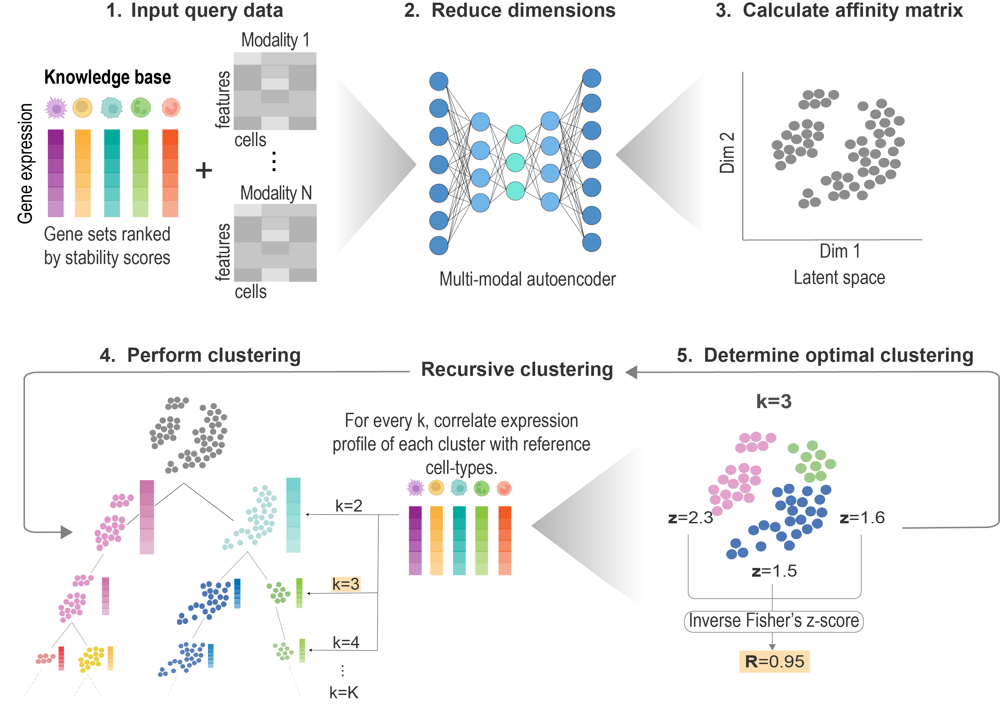
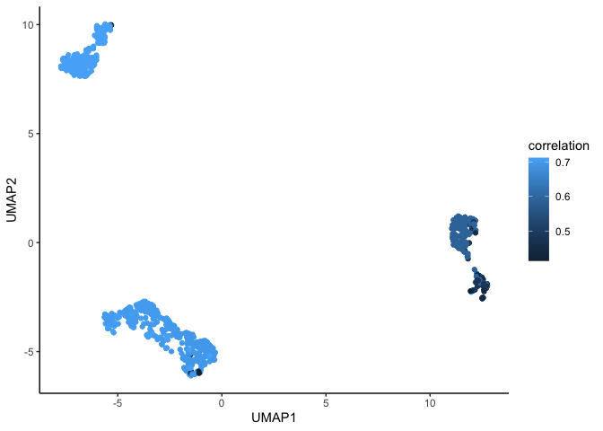

<!-- README.md is generated from README.Rmd. Please edit that file -->

# CLUEY

<!-- badges: start -->
<!-- badges: end -->

This is an R package for estimating the number of clusters in uni and
multi-modal single-cell data. CLUEY uses cell-type identity markers to
guide the clustering process and performs recursive clusters to ensure
that sub-populations are captured.



## Dependencies

CLUEY requires both keras and tensorflow, please have both installed.
You can follow the instructions provided at this
[link](https://tensorflow.rstudio.com/install/).

## Installation

CLUEY can be installed using the following command:

``` r
library(devtools)
install_github("SydneyBioX/CLUEY")
```

## Generating knowledge base

You can generate your own knowledge base using the
`generateKnowledgeBase` function like below:

``` r
knowledgeBase <- generateKnowledgeBase(exprsMat=logcounts(sce), celltypes=sce$cellType)
```

## Cluster data

In this example, we will upload an example knowledge base generated from
the [Mouse Cell Atlas
(FACS)](https://www.nature.com/articles/s41586-020-2496-1) and cluster
an example query dataset which was subsampled from [Zilionis et
al.](https://pubmed.ncbi.nlm.nih.gov/30979687/) using the `runCLUEY`
function.

``` r
library(CLUEY)
library(scater)
library(ggplot2)
library(gridExtra)

set.seed(3435)

# Load example knowledge base
data(mcaFACS)

# Load example query data
data(exampleData)

# Run CLUEY
# If your logcounts matrix is in dgCMatrix format, then you'll need to convert it to a matrix using `as.matrix()`
clustering_results <- runCLUEY(exprsMatRNA=as.matrix(logcounts(exampleData)), knowledgeBase=mcaFACS, kLimit=10, encodingDim1=10, encodingDim2=5)
#> 25/25 - 0s - 103ms/epoch - 4ms/step
#> 9/9 - 0s - 87ms/epoch - 10ms/step
#> 26/26 - 0s - 115ms/epoch - 4ms/step
#> 12/12 - 0s - 90ms/epoch - 8ms/step
#> 11/11 - 0s - 103ms/epoch - 9ms/step
#> 15/15 - 0s - 99ms/epoch - 7ms/step
#> 17/17 - 0s - 123ms/epoch - 7ms/step
#> 5/5 - 0s - 102ms/epoch - 20ms/step
#> 13/13 - 0s - 93ms/epoch - 7ms/step
```

## Viewing results

We can now view the results of the clustering performed by CLUEY. CLUEY
predicts there to be 5 clusters in the data.

``` r
set.seed(3435)

# View the optimal number of clusters predicted by CLUEY
clustering_results$optimal_K
#> [1] 6

# We can store the results in the metadata of our SingleCellExperiment object. 
colData(exampleData) <- cbind(colData(exampleData), clustering_results$predictions)

# Run UMAP to visualise clusters
exampleData <- runPCA(exampleData)
exampleData <- runUMAP(exampleData)
umap <- data.frame(reducedDim(exampleData, "UMAP"))
umap$cluster <- as.factor(exampleData$cluster)
umap$correlation <- exampleData$correlation

ggplot(umap, aes(x=UMAP1, y=UMAP2, color=cluster)) + geom_point() + theme_classic()
```


