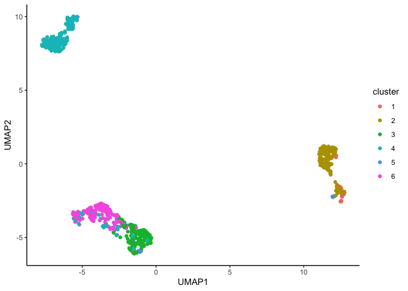

<!-- README.md is generated from README.Rmd. Please edit that file -->

# CLUEY

<!-- badges: start -->
<!-- badges: end -->

This is an R package for estimating the number of clusters in uni and
multi-modal single-cell data. CLUEY uses cell-type identity markers to
guide the clustering process and performs recursive clusters to ensure
that sub-populations are captured.

|  |
|:---------------------------------:|

## Dependencies

CLUEY requires both keras and tensorflow, please have both installed.
You can follow the instructions provided at this
[link](https://tensorflow.rstudio.com/install/).

## Installation

CLUEY can be installed using the following command:

``` r
library(devtools)
install_github("SydneyBioX/CLUEY")
```

## Generating knowledge base

You can generate your own knowledge base using the
`generate_knowledgebase` function like below:

``` r
knowledgeBase <- generate_knowledgebase(reference=logcounts(sce), celltypes=sce$cellType)
```

## Cluster data

In this example, we will upload an example knowledge base generated from
the [Mouse Cell Atlas
(FACS)](https://www.nature.com/articles/s41586-020-2496-1) and cluster
an example query dataset which was subsampled from [Zilionis et
al.](https://pubmed.ncbi.nlm.nih.gov/30979687/) using the `run_CLUEY`
function.

``` r
library(CLUEY)
library(scater)
library(ggplot2)
library(gridExtra)
set.seed(3435)

# Load example knowledge base
data(mcaFACS)

# Load example query data
data(exampleData)

# Run CLUEY
# If your logcounts matrix is in dgCMatrix format, then you'll need to convert it to a matrix using `as.matrix()`
clustering_results <- run_CLUEY(rna=as.matrix(logcounts(exampleData)), knowledgebase=mcaFACS, k_limit=10)
#> 50/50 - 0s - 93ms/epoch - 2ms/step
#> 5/5 - 0s - 42ms/epoch - 8ms/step
#> 6/6 - 0s - 43ms/epoch - 7ms/step
#> 10/10 - 0s - 44ms/epoch - 4ms/step
#> 6/6 - 0s - 41ms/epoch - 7ms/step
```

## View results

We can now view the results of the clustering performed by CLUEY. CLUEY
predicts there to be 5 clusters in the data.

``` r
set.seed(3435)

# View the optimal number of clusters predicted by CLUEY
clustering_results$optimal_K
#> [1] 6

# We can store the results in the metadata of our SingleCellExperiment object. 
colData(exampleData) <- cbind(colData(exampleData), clustering_results$predictions)

# Run UMAP to visualise clusters
exampleData <- runPCA(exampleData)
exampleData <- runUMAP(exampleData)
umap <- data.frame(reducedDim(exampleData, "UMAP"))
umap$cluster <- as.factor(exampleData$cluster)
umap$correlation <- exampleData$correlation

ggplot(umap, aes(x=UMAP1, y=UMAP2, color=cluster)) + geom_point() + theme_classic()
```



## View correlation scores

We can also view the correlation scores associated with the predicted
clusters.

``` r
ggplot(umap, aes(x=UMAP1, y=UMAP2, color=correlation)) + geom_point() + theme_classic()
```


``` r

# Only keep clusters with correlation scores > 0.65
#new_data <- exampleData[,exampleData$correlation > 0.65]
```

# Run CLUEY on multiomic data

## Cluster data

In this example, we will upload an example knowledge base generated from
the [Human Cell Atlas
(10X)](https://genomebiology.biomedcentral.com/articles/10.1186/s13059-020-02210-0)
and cluster an example multiomic query dataset from [Swanson et
al.](https://pubmed.ncbi.nlm.nih.gov/33835024/) using the `run_CLUEY`
function, like previously. Note that we do not require a multiomic
reference to predict clusters in a multiomic query dataset.

``` r
set.seed(3435)
# Load example knowledge base
data(hca10X)

# Load example query data
data(multiomicExampleData)

# Run CLUEY
# If your logcounts matrix is in dgCMatrix format, then you'll need to convert it to a matrix using `as.matrix()`
clustering_results <- run_CLUEY(rna=as.matrix(multiomicExampleData$counts), modalities=as.matrix(multiomicExampleData$other), knowledgebase=hca10X, k_limit=10)
#> 407/407 - 0s - 460ms/epoch - 1ms/step
#> 75/75 - 1s - 600ms/epoch - 8ms/step
#> 28/28 - 0s - 195ms/epoch - 7ms/step
#> 40/40 - 0s - 282ms/epoch - 7ms/step
#> 16/16 - 0s - 292ms/epoch - 18ms/step
#> 47/47 - 0s - 333ms/epoch - 7ms/step
```

## View results

``` r
set.seed(3435)

# View the optimal number of clusters predicted by CLUEY
clustering_results$optimal_K
#> [1] 9

sce <- SingleCellExperiment(assays = list(logcounts = multiomicExampleData$counts), colData = multiomicExampleData$celltypes)

# We can store the results in the metadata of our SingleCellExperiment object. 
colData(sce) <- cbind(colData(sce), clustering_results$predictions)

# Run UMAP to visualise clusters
sce <- runPCA(sce)
sce <- runUMAP(sce)
umap <- data.frame(reducedDim(sce, "UMAP"))
umap$cluster <- as.factor(sce$cluster)
umap$correlation <- sce$correlation

ggplot(umap, aes(x=UMAP1, y=UMAP2, color=cluster)) + geom_point() + theme_classic()
```


## View correlation scores

``` r
ggplot(umap, aes(x=UMAP1, y=UMAP2, color=correlation)) + geom_point() + theme_classic()
```


